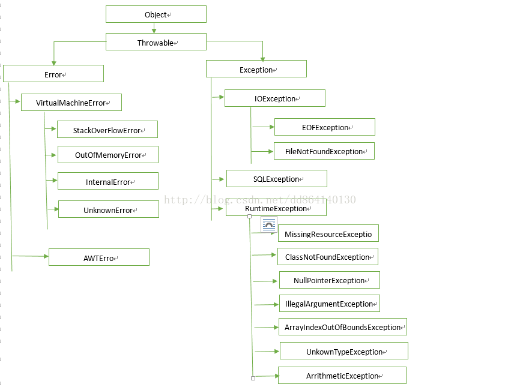

# 多态

当父类引用指向子类对象，调用的属性和方法如果在父类中没有，就报错。而且获得的是父类的属性值，并非子类属性值。但是如果普通方法被子类重写，就会在运行时动态指向子类的方法。如果是静态方法被重写，那么用父类引用调用该静态方法，只能看到父类的静态方法，因为是编译时就决定的。

# 类

## 抽象类和接口

1. 抽象类可以有构造函数，接口不能有
2. 抽象类可以有属性，接口只能有静态变量
3. 接口可以多实现，抽象类只能单继承
4. 抽象类可以实现方法，接口只能有default实现的方法

**default**：jdk1.8之后，接口中可以添加使用default或者static修饰的方法，接口自己可以实现被default修饰的方法，实现接口的类继承接口自己的实现，也可以在具体实现类覆盖方法。

1. 当有多个接口都实现了同名的default方法，子类实现多个接口时，必须在子类中覆盖各个接口自己的实现，否则编译不能通过。
2. 当某个接口中有default方法，同时该子类的父类也有同名的非抽象方法，子类对象如果没有覆盖这个方法，那么优先继承父类的方法。如果父类中的同名方法是抽象的，那么则要求子类必须覆盖这个方法。

## 内部类

**静态内部类**

可以有静态变量，同时生成静态内部类时不需要先生成外部类对象。对于外部类来说是类属性。所以无法访问外部类的成员变量。

1）在非外部类中：外部类名.内部类名 name = new 外部类名.内部类名();

2）在外部类中：内部类名 name = new 内部类名();

**普通内部类**

不可以有静态变量，同时生成普通内部类时需要先生成外部类对象。内部类可以访问所有变量。

外部类名.内部类名 变量名 = new 外部类名().new 内部类名();

## 基本类型

### 分类

* boolean - Boolean  1比特

* byte - Byte 1字节（8比特）hashcode返回value。

* char - Character 2字节

* short - Short 2字节。hashcode返回value。

* int - Integer 4字节，范围（-2的31次方，2的31次方-1）。Integer的hashcode方法返回integer的value。

* float - Float 4字节（声明必须使用 ```float a = 3.4f```，不加f则被认为是double类型，不能进行强制类型转换，编译通不过）。转为int再hashcode。

  float和double两种浮点型数据不能简单用equals比较大小，应该设着已经差异精度，或者用BigDecimal精确比较。

* double - Double 8字节。转为long型再hashcode。

* long - Long 8字节 （long转float不需要强制类型转换）范围（-2的63次方，2的63次方-1）。Long的hashcode为（value ^ （value >>> 32））。

### 存储位置

在方法中声明的变量，即局部变量是存放在栈帧中。在类中声明的成员变量在堆内存中，静态变量存在于方法区中，1.8以后存放在堆中。局部变量表中有多个slot，double和long占两个slot。在编译时就确定了局部变量表的大小。

# 异常

## 体系结构图



## Error

程序中无法处理的错误，一般代表JVM运行过程中出现了问题。发生这类错误时，JVM将停止线程。所以不应该在代码中处理这类问题。

## Exception

程序本身可以捕获并且可以处理的异常。

### 1. RuntimeException

运行时异常：常见的空指针、数组越界、除以0等异常都是这类异常。这种异常通常是由于程序逻辑错误引起，可以选择捕获处理，也可以不处理。尽量在代码编写过程中就避免运行时会出现这种异常，而不是注重出现异常之后的补救。

### 2.非RuntimeException（编译异常）

程序中如果出现此类异常，必须对异常进行处理，否则编译通不过。这类异常必须用try-catch捕获处理，要么throws语句抛出。

### 异常处理

#### 1. try-catch-finally

当三个代码块中抛出异常时，代码块中剩余的代码将不会执行，即使在finally中抛出异常，finally也会终止执行。如果finally中没有异常，则程序必然执行完整的finally代码块，即使在try-catch中有return，也要先执行完finally再return。

#### 2. throws

在方法声明处抛出异常

```java
methodName (params) throws Exception1, Exception2{}
```

#### 3. throw

在函数体内抛出异常

``` java
throw new Exception();
```

# 字符串

## String

## StringBuffer

构造方法不是synchronized修饰，另外有insert、indexOf、lastIndexOf、readObjec。Note, synchronization achieved via invocations of other StringBuffer methods

## StringBuilder

线程不安全，扩容长度：当前长度*2+2，若还是小于新的字符串的最小长度，则扩容到最小长度。

# 集合

## 集合类

### ArrayList(1.8) 线程不安全

初始容量为0，只有在第一次add元素时，才扩容到10。之后每次扩容都是之前的1.5倍。最大容量为Integer.MAX_VALUE。

**Array.asList()**的注意事项：

Arrays.asList() 返回java.util.Arrays$ArrayList， 而不是ArrayList。

Arrays$ArrayList和ArrayList都是继承AbstractList，remove，add等 method在AbstractList中是默认throw UnsupportedOperationException而且不作任何操作。

ArrayList override这些method来对list进行操作，但是Arrays$ArrayList没有override remove()，add()等，所以throw UnsupportedOperationException。

### Vector

所有方法都使用synchronized实现同步。

### LinkedList

底层元素是包含双向指针的Node节点。以链表形式存储节点。

**linkedlist和ArrayList哪个更占用空间？**

在一般情况下，是LinkedList更占空间，因为要维持双向指针。但是由于ArrayList扩容的机制，可能由于数组中很多位置没有被利用而空占空间。但是ArrayList中数组是transient类型，不会被序列化，它重写了序列化时的操作，只序列化数组中有的元素，所以序列化后占用空间比LinkedList小。

### Collections.synchronizedList(List<E> list)

使用指定的对象或者list对象做同步锁，synchronized锁住除迭代器方法之外的所有方法。在迭代器遍历时需要锁定列表对象。

### CopyOnWriteArrayList 线程安全

写时复制一份数组进行操作，对操作的数组加锁。读线程不会受到写线程影响，但是可能读到旧的数据。内部操作使用Reentrantlock加锁。

### HashMap(1.8) 线程不安全

属性分析：

**MIN_TREEIFY_CAPCITY**：当map中节点数大于这个值时，才将链表转换成红黑树，否则会进行扩容。至少是四倍TREEIFY_THRESHOLD。

**UNTREEIFY_THRESHOLD**：当红黑树中节点小于这个值，转换成链表。

判断key相等的规则：判断两个对象**int hashCode()**相等，认为对象在同一个下标上，继续判断**bollean equals()**是否为真，若为真，则认为两个对象相等。

数组索引计算方法：

```java
(hash = key.hashcode()) ^ (hash>>>16);
index = hash &（size（）-1）;
```

初始容量16，负载因子0.75。

```put()```分析：

首先判断表是不是空的，如果是先扩容；然后判断对应的entry数组中hash下标处是否为空，如果是空直接填入entry数组；不是空的话遍历链表或者红黑树，查找有没有相同的key，如果有，更新链表或者树中的值，如果没有，在链表尾部插入（1.8之前头插）entry；插入后长度如果大于8，转化为红黑树。最后判断是否需要扩容，如果需要扩容，就扩。

允许一个key或者多个value为null。

Q：为什么链表长度是8的时候转换为红黑树而不是直接使用红黑树？

A：红黑树的插入、删除和遍历的最坏时间复杂度都是log(n)，但是需要的空间是两倍，而链表的插入只需要O(1)时间复杂度，在链表很短的时候遍历也很快。而当hash算法很均匀的情况下，根据**泊松分布**几乎长度不会到8，只有很差的hash算法才会导致到8。是一种时间和空间的权衡。

Q：为什么hashmap线程不安全?

A：在1.7之前，采用头插法，扩容的时候可能会出现链上节点相互引用成环，导致无限循环。1.8以后用尾插法，避免了死循环，但是在其他情况下还是会出现数据丢失覆盖等问题。

Q：为什么容量是2的幂次？

A：因为当容量是2^n时，h & (length - 1) == h % length。而且位运算比求余运算快得多。扩容时只需要计算一位就能得到新下标。即使初始容量不是2的n次，也会找到最小的大于容量的2的n次。

### LinkedHashMap 线程不安全

按照元素的**插入顺序**排序或者按照**读取的顺序**排序。插入顺序是先插入的在前面，后插入的在后面，读取数据是将每次读取过的数据放在链表最后。如果设置了缓存策略需要淘汰，淘汰链表头部的节点。

key和value都不允许为空。

重复插入已有的key，那么只会更新value，而不会改变key的位置

里面的entry节点具有指向前面节点和后面节点的指针。

构造函数：

```java
// 这里的 accessOrder 默认是为false，如果要按读取顺序排序需要将其设为 true,先插入或者后访问的在前
// initialCapacity 代表 map 的 容量，loadFactor 代表加载因子 (默认即可)
public LinkedHashMap(int initialCapacity, float loadFactor, boolean accessOrder) {
    super(initialCapacity, loadFactor);
    this.accessOrder = accessOrder;
}
```

用于覆盖设置自定义的缓存策略，指定在什么条件下才会淘汰链表中的元素：

```java
// 这里是举例，如果尺寸大于容量时，就要求删除。
protected boolean removeEldestEntry(Map.Entry eldest) {
        return size() > capacity; 
}
```

### TreeMap 线程不安全

底层实现是红黑树，每个节点都有指向父与左右子节点的指针以及颜色。get方法会从父节点根据二叉搜索树的性质来查找。put方法会找到一个叶子位置插入一个红色节点，并且根据选择着色来调整红黑树的稳定。

如果是默认的comparator，key不可以是null。

如果是自定义的comparator，如果没有对null的明确规定，否则在插入时抛出NullPointerException 异常；如果有了规定，可以遍历到null键，但是不能去get（null）。

**增删改查的时间复杂度均为logn**。判断重复的方法是compare()是否返回0，而不用equals。

### HashSet

底层数据结构是HashMap，内部有一个空的object对象作为所有键的值，add的内容是hashmap的键。

## 高级集合知识

### 快速报错机制ConcurrentModificationException

**快速报错机制（fail - fast）**

所有使用modCount属性的集合全是线程不安全的，在涉及到内部结构的变更时会同时更改modCount。但是在对应的迭代器中，modCount才会起作用。不涉及迭代器就不抛异常。Iterator自己的remove操作会主动更新exceptModCount，保证一致。

例如在ArrayList中，只有**add**和**remove**方法是对结构的变更，会对modCount++，而修改数组内部元素的**set**则不算，不改变modCount，也不会导致fail-fast。

一个迭代器初始的时候会赋予它调用这个迭代器的对象的modCount，如果在迭代器遍历的过程中，一旦发现这个对象的modCount和迭代器中存储的expectModCount不一样那就抛ConcurrentModificationException异常。

建议并发使用集合时，用juc包中的集合类。

### 集合的遍历

#### Iterator< E >

迭代器模式：提供一种方法按某种顺序访问一个聚合对象（常见的集合）中各个元素，而又不暴露该对象的内部表示。

迭代器模式中的角色：
迭代器角色（Iterator）: 负责定义访问和遍历元素的接口。 
具体迭代器角色（Concrete Iterator）：实现迭代器接口，并要记录遍历中的当前位置。 实现**next()**，**hasNext()**方法。
容器角色(Container): 负责提供创建具体迭代器角色的接口，比如Iterable<T>接口。 
具体容器角色（Concrete Container）：实现创建具体迭代器角色的接口， 这个具体迭代器角色与该容器的结构相关。实现**iterator()**方法产生具体迭代器对象。

访问集合，集合返回集合中的对象的引用，如果将引用直接指向其他对象，不会改变集合内的元素，但是如果通过引用修改对象的属性，那么集合中的元素就会发生变化。

```java
//Iterator it = collection.iterator();
// 循环条件：如果迭代器内还有未访问的元素，返回true
//while(it.hasNext()){
	// 返回迭代中的下一个元素
	//Object obj = it.next();
	// 移除迭代器返回的上一个元素（最后一个）
	//it.remove();
//}
```

#### Foreach

如果想用foreach遍历集合，那么集合必须实现了Iterable<T>接口，然后底层是用iterator来遍历。

如果是遍历基本类型数组，foreach**只能访问，不能修改**，因为不是操作引用，而是操作值。

```java
for(Object o : collection){
	//访问操作
}
```

#### For 

只用于list访问，添加或删除元素时会出错，所以只用于访问。

```
for(int i = 0; i < list.size();i++){
	//访问操作
}
```

# 流

### 流为什么要关闭

因为当我们用了虚拟机以外的资源，比如端口、显存、文件的时候（访问本地资源），超出了虚拟机能够释放资源的界限，这时候虚拟机并不能通过垃圾回收机制对你占用的资源进行释放，如果在没有关闭的情况下第一次运行程序是不会发生问题的，但是随着资源占有量逐渐增多而你又不自己进行close释放资源的话，垃圾只会越积越多，导致系统无法存储其他的资源，甚至会导致系统崩溃。如果你再次对未关闭流的文件进行读写，编译就会报错，告诉你这个文件被占用。

# 不可变类

不可变对象：对象一旦被创建后，对象所有状态和属性在生命周期内不会发生变化。JDK中的**String**和**包装器类**是不可变类。使用不可变类的引用传参数时，不会修改之前的对象，是一种**值传递**。

优点：

1. 不可变对象省去了并发编程中的同步控制，不用担心线程安全问题。
2. 防止在代码中不小心修改对象
3. 减少容器使用过程出错的情况，因为对象一旦被修改，可能hash值就会被修改，然后hashmap认为新对象不是之前的key，返回不存在。

如何创建不可变对象：

1. 成员变量必须private
2. 最好用final修饰成员变量
3. 不提供能修改原有对象属性的方法，如set。如果非要提供修改方法，应该返回一个新的对象。
4. 通过构造器初始化所有成员变量，引用类型的成员变量必须进行深拷贝。
5. 不能暴露this引用和成员变量引用
6. 最好使类不被继承，可以使用final修饰类或者是使用私有的构造函数

# String

### string类被final修饰

防止被继承导致错乱。

### string不可变

实现原理 **private + final** 实现不可访问＋不可修改引用 = 不可变

为什么不可变？

1. 为了实现字符串常量池，因为许多string引用指向同样的字符串对象（复用），如果修改了其中一个字符串对象，其他引用指向的对象也会被修改，导致出错。
2. 字符串不可变保证某些情况下的安全性，如防止socket通信中主机端口号被篡改。
3. 多线程安全
4. 字符串在创建时候hashcode就被缓存，适合做map的key，处理速度快

# 引用类型

1. 强引用：被强引用的对象无论何时都不会被gc
2. 软引用：只有在内存不够时才会被gc
3. 弱引用：只要被垃圾扫描线程扫描到，就会被回收
4. 虚引用：配合引用队列使用，检查某个对象有没有被回收，任何时候都可能被回收，只是为了跟踪垃圾回收的活动，并且回收时将该引用加入引用队列。

# 泛型

**泛型擦除**

 泛型在编译为字节码时，泛型会被Object类取代。如果使用泛型上界来定义，那么会被取代为上界的类。

**通配符**：

1. **上界通配符**：``` <? extends A>```

   表示此处泛型的参数必须是A或者A的子类，否则编译失败。同时泛型中可以使用A的方法。上界通配符只能使用A类引用读数据，不能写数据。

2. **下界通配符**：``` <? super A>```

   表示此处泛型的参数必须是A或者A的父类，直到Object，否则编译失败。下界通配符只能用于写A类数据，不能读数据。

注：https://stackoverflow.com/questions/4343202/difference-between-super-t-and-extends-t-in-java

# 序列化

## 方式

1. 实现Serializable接口，由jvm自动序列化，调用了writeObject；或者实现Externalizable，重写其中的读写方法，指定部分属性序列化。

   其中**transient和静态变量不会被序列化。**

2. **把对象包装成json字符串传输**。跨语言，可读性强。

3. protoBuf序列化。更节省空间，速度快。需要编写额外代码。

