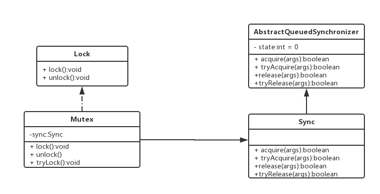

# 线程

线程状态 ：

1. **初始(NEW)**：新创建了一个线程对象，但还没有调用start()方法。
2. **运行(RUNNABLE)**：Java线程中将就绪（ready）和运行中（running）两种状态笼统的称为“运行”。
   线程对象创建后，其他线程(比如main线程）调用了该对象的start()方法。该状态的线程位于可运行线程池中，等待被线程调度选中，获取CPU的使用权，此时处于就绪状态（ready）。就绪状态的线程在获得CPU时间片后变为运行中状态（running）。
3. **阻塞(BLOCKED)**：表示线程阻塞于锁。
4. **运行中（RUNNING）**：线程正在执行中
5. **等待(WAITING)**：进入该状态的线程需要等待其他线程做出一些特定动作（通知或中断）。
6. **超时等待(TIMED_WAITING)**：该状态不同于WAITING，它可以在指定的时间后自行返回。
7.  **终止(TERMINATED)**：表示该线程已经执行完毕。

### 创建线程


```java
new Thread(){
	// 匿名内部类 new 父类名（）{ 子类新实现 } 
	@Override
	public void run(){
		do something;
	}
} 
```

```java
new Thread(Runnable())
```

调用线程的run方法，会使线程进入runnable状态。

`join()`：线程A中执行 `B.join(int time)`,要求线程A必须等线程B执行time 毫秒后才能开始执行，若time为0则表示等B执行完A再执行。join底层是执行了B.wait()，将A线程放入了B的等待池中，然后在B执行完或者等待了规定时间后，通过线程的```exit```方法来notifyAll()所有B的等待池中的线程。

### 父子线程

这里的父子关系是指父线程创建子线程，但是父线程结束不影响子线程。当jvm里只剩守护线程就会退出。

### 线程间通信

1. 等待/通知机制

   依靠wait/notify实现。或者是condition的等待通知。

   ```object.wait()``` ```object.notify()```必须写在 ```synchronized(object)```修饰的代码块中，因为只有线程获取了object的锁，才能执行object的这两个方法。

   线程执行完object.wait方法就阻塞了，同步代码中剩余的部分不会执行，直到被notify才会继续执行，其中thread.join内部会执行thread.wait，在某个线程结束时，会执行这个线程thread.notifyAll，所有等待这个线程的线程重新竞争。

2. 管程

   就是一个控制共享变量与条件变量的临界区，一次允许一个线程进入。线程进入后判断条件变量是否符合，如果符合则做处理，反之退回到等待队列，释放管程的锁。

3. 信号量 **Semaphore**

   就是类似于aqs中的state，需要去获取才能修改。如果获取不到或者信号量变为某个值，则会阻塞线程。

### synchronized

**实现原理**：

jvm基于进入和退出monitor对象来实现方法同步和代码块同步。编译后的monitorenter指令在进入同步代码块之前，monitorexit在方法结束之后或者是异常处。线程执行到monitorenter是会尝试获得对象的锁，及monitor的所有权。

看sychronized后面括号里的是哪个对象，如果是某个具体的实例对象，那么任何竞争这个实例对象的线程，该对象的所有synchronized方法都会被阻塞，非synchronized方法不会阻塞；如果是某个类对象，那么竞争任何这个类以及类的实例对象的线程都会被阻塞。不管阻塞的是否是同样的方法和代码块。

1. 修饰一个**代码块**，被修饰的代码块称为同步代码块，作用范围是大括号{}括起来的代码，作用的是调用这个代码块的对象，同一个对象调用内部每个synchronized修饰的代码块或方法，只会依次执行，一个代码块（方法）执行完才执行另一个代码块（方法）。

2. 修饰一个**方法**，被修饰的方法称为同步方法，其作用范围是整个方法；作用的是调用这个方法的对象，同一个对象调用内部每个synchronized修饰的方法或代码块，只会依次执行，一个代码块（方法）执行完才执行另一个代码块（方法）。

3. 修改一个**静态方法**，作用范围是整个静态方法，所有该类对象调用静态方法或静态代码块时会受同步的影响，修饰类的代码块也会受到影响。

4. 修改一个**类**，作用范围是synchronized后面括号括起来的部分。所有该类对象的所有静态同步方法或同步代码块会互相影响。

   ```synchronized(XXX.class){}```

**Synchronized的作用主要有三个**：

> 1. **原子性**：确保线程互斥的访问同步代码；
> 2. **可见性**：保证共享变量的修改能够及时可见，其实是通过Java内存模型中的 **“对一个变量unlock操作之前，必须要同步到主内存中；如果对一个变量进行lock操作，则将会清空工作内存中此变量的值，在执行引擎使用此变量前，需要重新从主内存中load操作或assign操作初始化变量值”** 来保证的；
> 3. **有序性**：有效解决重排序问题，即 **“一个unlock操作先行发生(happen-before)于后面对同一个锁的lock操作”**；

总结：**对象锁在同一个对象内的成员方法及代码块互相影响。类锁在所有同类实例的类方法及类同步的代码块里相互影响。**

**synchronized** 是可重入锁，指同一线程可以重复对同一个资源加锁，但是要记录锁的数量，只有占用的所有锁被释放，其他线程才能竞争锁。可重入锁释放的时候一定要等于加锁次数。

**公平锁** ：根据线程请求锁的先后顺序来分配锁，FIFO的方式。非公平锁就是线程每次都竞争锁。

**线程间通信** ：synchronized线程间通信的方式是 ` wait() notify()`通知等待模式，`notify()`会唤醒同一个对象`wait()`的线程，但是并不是立即唤醒，要等待synchronized加锁的代码执行完成，被唤醒的线程可以竞争对象锁。由于涉及到锁的竞争和释放，必须与synchronized结合使用。`sleep()`和`wait()`的区别是sleep不会释放锁和监视器，但是wait会。

**entry set** 和 **wait set**：

1. Entry Set：如果有线程已经持有了对象锁，此时如果线程A也想获得该对象锁的话，它只能进入Entry Set，并且处于线程的BLOCKED状态。
2. Wait Set：如果线程A调用了wait()方法，那么线程A会释放该对象的锁，进入到Wait Set，并且处于线程的WAITING状态。
3. 某个线程B想要获得对象锁，一般情况下有两个先决条件，一是对象锁已经被释放了（如曾经持有锁的前任线程A执行完了synchronized代码块或者调用了wait()方法等等），二是线程B已处于RUNNABLE状态。
4. 当持有锁的线程synchronized代码块结束时，只有entry list中的某线程会被JVM唤醒，然后该线程状态转为runnable。
5. 对于wait set中的线程，当对象的notify方法被调用时，JVM会随机唤醒其中的一个线程，调用notifyall时，唤醒全部线程，所有wait set中的线程都会被转移到entry set中。唤醒的意思是使状态转为runnable，并且转移到entry set中。

#### 1. ***synchronized*** 和 ***lock*** 的区别

synchronized 无法控制阻塞时长，而且不可被中断。用synchronized关键字的两个线程1和线程2，如果当前线程1获得锁，线程2线程等待。如果线程1阻塞，线程2则会一直等待下去，而Lock锁就不一定会等待下去，如果尝试获取不到锁，线程可以不用一直等待就结束了。

lock 是一种接口，而synchronized是jvm关键字。

lock指定代码段的入口和出口，作用同一对象加锁的代码段。

synchronized无法判断是否获取锁的状态，Lock可以判断是否获取到锁；

synchronized会自动释放锁(a 线程执行完同步代码会释放锁 ；b 线程执行过程中发生异常会释放锁)，Lock需在finally中手工释放锁（unlock()方法释放锁），否则容易造成线程死锁；

synchronized的锁可重入、不可中断（获取锁的过程中不能中断，获取到锁以后可以中断）、非公平，而Lock锁可重入、可中断、可公平（两者皆可）

### 中断

线程中断是一种协作机制，线程可以通过这种机制来通知另一个线程，告诉它在合适的或者可能的情况下停止当前工作。

```java
public class Thread{
    // 设置中断标志位为true
    public void interrupt(){...}
    // 返回中断标志位
    public boolean isInterrupted(){...}
    // 返回中断标志位，并且重置为false
    public static boolean interrupted(){...}
}
```

在中断标志位为true的时候，执行join、wait、sleep方法，会抛出一个InterruptedException，重置为false。

### Runnable 和 Callable

Runnable需要实现`run()`方法，没有返回值。Callable需要实现`call()`，返回一个Futrue对象，表示异步计算的结果。

call方法可以抛出异常，run方法必须在内部处理异常。

线程池的`Executor.execute()`方法向线程池提交不需要返回值的任务，就是实现了Runnable接口的对象。`ExecutorService.submit()`方法向线程池内提交需要返回值的任务，会将其他任务包装成Callable对象，并返回一个Future对象，如果没有返回值就是null。

### FutureTask 

实现了Future接口和Runnable接口，可以交给Executor执行，也可以调用线程执行。未启动或者已启动状态执行`FutureTask.get()`会阻塞调用的线程。可以执行`cancel()`取消已启动的线程。

### AbstractQueuedSynchronizer



如果我们使用AQS自己实现一个锁，就要按uml图中的方法，实现的锁是Mutex类，这个类实现了Lock接口，并且实现了lock和unlock方法；另外有个继承自AQS类的Sync类作为一个内部类，内部类根据自己的需求重写这些方法。acquire()是获取锁，内部需要执行tryAcquire(int arg)来判断能否获取锁。release()释放锁，tryRelease()用于释放锁，防止锁的不当释放，比如某线程释放了其他线程的锁。

```java
public class Mutex implements Lock{
    //AQS子类的对象，Mutex互斥锁用它来工作
	private Sync sync = new Sync();
    private class Sync extends AbstractQueuedSynchronizer{
        @Override
        protected boolean tryAcquire(int arg){}
        protected boolean tryRelease(int arg) {}
    }
    @Override
    public void lock(){
        sync.acquire(1);
    }
    @Override
    public void unlock(){
        sync.release(1);
    }
}
```

如果我要实现一个可重入锁，我只需要在tryAcquire里判断请求锁的线程是否是已经持有锁的线程。同时也要在tryRelease中判断释放锁的线程是不是持有锁的线程。

用于实现自定义lock的底层同步器。可以实现独占和共享两种资源共享方式。

核心数据结构：链式队列 + (volatile int) state资源值

底层操作：线程竞争资源值，通过cas对state进行修改，队列头节点自旋等待state被释放。公平锁实现是判断线程有没有前驱线程，新来的线程判断队列有没有线程，如果有则不能竞争，非公平锁则不需要判断就可以竞争，第一次竞争失败会自旋一次，若还没有竞争到，则被包装成一个node，通过cas加入到等待队列的末尾。

**独占锁的获取**：acquire try获取两次，获取失败后作为被包装成node，通过cas添加到队列末端，同时被添加的node不停自旋（死循环）来获取锁。{当一个node的前驱节点为头并且try成功之后，修改自己为头节点，若前驱非头，则cas修改前驱状态码为signal，移除cancel的前驱节点，然后阻塞自己的线程（LockSupport.park）。}

**独占锁的释放**：try成功后，解除后继node的阻塞。使后继node线程可以继续死循环获得锁。

**等待队列**：等待condition的节点根据不同的condition放入不同的队列。当有signal执行时，将condition队列头的node移动到同步队列末尾，再进行索取锁或者阻塞。

node结构：线程指针、等待状态（表示线程的当前状态：cancel、signal、condition、propagate、0）、同步队列前驱后继指针、等待队列后继指针

### 线程池

Java的线程既是工作单元，也是执行机制。从JDK 5开始，把工作单元与执行机制分离开来。工作单元包括Runnable和Callable，而执行机制由Executor框架提供。

#### 核心参数

1. 核心线程数
2. 最大线程数
3. 空闲线程存活时间、单位
4. 任务队列
5. 拒绝策略
6. 线程工厂

关于线程池线程数的设计：

1. cpu密集型，即CPU使用率较高，阻塞较少，一般线程数=cpu核数
2. io密集型，最佳线程数目 = （（线程等待时间+线程CPU时间）/线程CPU时间 ）* CPU数目

#### 线程池状态

1. RUNNING：线程池能够接收新任务并且处理已接收的任务
2. SHUTDOWN：不能接受新任务，但可以处理已接收的任务
3. STOP：不能接受新任务，不处理已接收的任务，终止正在进行的任务
4. TIDYING：所有任务都结束并且有效线程数记录的任务数量为0，变成这个状态，然后执行terminate函数
5. TERMINATE：线程执行完terminate函数后，从TIDYING变成此状态

#### 1. 为什么线程池能保持一定的线程不释放？

线程池在当前核心线程的任务执行完之后，会去阻塞队列取新的任务执行，如果阻塞队列没有新的任务，核心线程会不停执行取任务的操作，无限循环，直到有新的任务进入队列。

#### 2. 线程池任务的先后顺序？

线程池线程数小于核心线程数，则会创建新线程用于执行新的任务；如果核心线程已满，则将任务放到队列中；线程池数小于最大线程数时，创建临时线程去队列中取任务，临时线程执行完后没有任务就删除线程，否则继续取任务执行；当队列已满且线程数达到上限，则根据线程池的拒绝策略拒绝新任务。

#### 3. 线程池的优点？

节省了频繁创建新线程的开销。

#### 4. 线程池的拒绝策略

* abortPolicy：线程池满直接抛出异常，之前添加的可以执行完成，后面的都被拒绝
* callerRunsPolicy：任务被拒绝添加后，调用线程池所在的工作线程去执行被拒绝的任务，执行这个任务会阻塞原先的线程
* DiscardPolicy：直接拒绝任务不作任何其他处理
* DiscardOldestPolicy：任务被拒绝添加时，抛弃任务队列中的第一个任务，再添加新任务

#### 5. 四种线程池

newCached、fixed、scheduled、single

### volatile

volatile写操作后，汇编代码添加了Lock指令，该指令的含义是将缓存行写入主存，同时使其他缓存了这个内存地址内容的缓存行失效。


根据Java内存模型（JMM），每个线程都有自己的工作内存，同时有个Java主内存，一般时候线程会根据自己的工作内存中的数据进行处理，但是当其他线程更改了数据，并且写入了主存，之前的线程的数据就过时了。所以要求这种数据在主存更新的时候，必须让其他线程在读取数据时，读取到最新的数据，但是如果已经读取到了数据，那么在不需要读取的时候，就还是使用工作缓存中的数据。

**volatile不能保证线程安全的原因**：

例如：i++语句，在底层分为三个原子操作：1. 读取i  2. 计算i+1 3. 将计算得到的值写到i的位置。如果两个线程同时执行i++，即使 i 是volatile修饰，如果两个线程先都读取了i，那么其中一个先执行完修改后，写入主存的值，也不会再影响另一个线程，因为读数据操作已经结束。

volatile 保证了数据的可见性和指令的有序性，被修饰的指令不可以被重排序，但是之前的可以打乱顺序，之后的也可以打乱，但是前后之间不能打乱。volatile的变量根据happen before原则，写操作会先于读操作。

**MESI缓存一致性协议**

当volatile变量写入时，会在总线发出信号，宣布这个变量被更改，其他线程的工作内存中的缓存失效。其他线程在读变量之前，会使用**嗅探**来查看自己的缓存是否过期。

状态：

- M（修改, Modified）: 本地处理器已经修改缓存行, 即是脏行, 它的内容与内存中的内容不一样. 并且此cache只有本地一个拷贝（专有）。
- E（专有, Exclusive）: 缓存行内容和内存中的一样, 而且其它处理器都没有这行数据。
- S（共享, Shared）: 缓存行内容和内存中的一样, 有可能其它处理器也存在此缓存行的拷贝。
- I（无效, Invalid）: 缓存行失效, 不能使用。

**总线风暴**

工作线程会不停的嗅探和循环cas，无效交互会导致总线带宽达到峰值。

**重排序方式**

1. 编译期，在不改变单线程程序语义的情况下，可以重排序
2. 指令级并行重排序，ILP技术使多条指令重叠执行，如果不存在数据依赖性，处理器可以重排序
3. 内存系统重排序，由于使用了缓存机制，使加载和存储操作看上去在乱序执行

编译期重排序可以在JVM中禁止特定类型的重排序来阻止，处理器重排序是JVM在生成指令序列时，添加内存屏障来实现

**volatile防止代码重排序的原因**：

volatile读操作在前时，不允许之后的任何读写重排序到之前；volatile写操作在后时，不允许任何读写操作重排序到之后。

使用了内存屏障，内存屏障可以要求屏障前后的指令不能重排序，volatile会在读数据之后加loadload 和 loadstore，阻止之后的读写重排序，写数据之前会加storestore 和 storeload（全能屏障），阻止前后的读写重排序。会根据具体情况优化屏障指令。

synchronized可以保证原子性、有序性和可见性，但是都是通过同步的方式来实现。

**问题：** 在不使用volatile关键字的情况下，有哪些情况会导致线程的工作内存失效，然后必须重新去读取主存的共享变量？

1、线程中释放锁时

2、线程切换时

3、CPU有空闲时间时（比如线程休眠时）

### java的锁优化

#### 1. **自旋锁**

当一个线程获取锁，如果锁被其他线程占有，则会持续不断的请求锁，直到获取到锁。这种锁是非公平锁，也无法保证可重入，可以不需要进入阻塞挂起状态，可以避免用户线程和内核线程的切换的消耗。 适合在线程执行时间较短，锁竞争不激烈的情况下使用。

#### 2. 锁升级、锁膨胀

锁膨胀就是指随着竞争锁的线程自旋次数越来越多，锁会由偏向锁->轻量级锁->重量级锁。但是锁不能降级，为了提高释放锁和获取锁的效率。

参考：[锁升级](https://www.zhihu.com/search?type=content&q=锁升级)

0. **无锁**

偏向锁为0，锁状态为01

1. **偏向锁**

“偏向于第一个获得它的线程”的锁。**获取**：如果是无锁状态，那么将对象头的hashcode替换成自己的线程id，然后修改锁状态（偏向锁改为1和标志位01）。执行完同步代码块后不会立即释放偏向锁，当第二次执行到同步代码块时会判断对象头中锁偏向的线程是否就是自己，如果是则继续执行。这里没有锁的释放与重新加锁，几乎没有额外开销。**撤销**：等到全局安全点（没有字节码正在执行），暂停持有偏向锁的线程，并判断持有偏向锁的线程是否存活。如不存活，恢复对象到无锁，若存活，撤销完之后在原先偏向锁线程中先复制一份displace Markword，cas修改对象头，锁状态改为00，保存指向栈中锁记录的指针。

2. **轻量级锁（自旋）**

当有第二个线程竞争锁（多个线程在竞争锁的过程中被阻塞，不阻塞不算），偏向锁就升级为轻量级锁。**获取**：先去比较偏向锁的线程是否就是自己的线程，如果不是会触发对象偏向锁的撤销。线程会自旋，直到对象头中的锁字段变为释放，则设置为锁定，这两个操作合在一起是一个原子，并且修改锁的持有者为自己。**撤销**：将displace markword的指针通过cas操作替换回对象头。若替换不成功，则有其他线程也在竞争。升级为重量级锁。

3. **重量级锁Synchronized**

线程自旋到一定次数之后，会修改对象头的锁为重量级锁，请求锁不到的线程会被挂起。**获取**：申请一个monitor对象，Markword指向monitor，monitor中的owner指向持有重量级锁的线程，其他竞争的线程放入monitor的等待集合中。对象内都有一个monitor对象，monitor对象控制同步代码，记录重入数量，同时还有两个队列，一个是wait set， 另一个是entry set，当没有线程持有对象的monitor时，entry set中的线程和wait set中**被唤醒**的将会竞争。执行完被保护的代码段或者被wait就会释放对象的monitor。

#### 3. 锁粗化

减少不必要的紧连在一起的 lock，unlock 操作，**将多个连续的锁扩展成一个范围更大的锁**。

#### 4. 锁消除

如果同步块内的数据没有被其他线程加锁保护，那么就认为没有线程安全问题不需要加锁。

### 乐观锁和悲观锁

悲观锁：每次读共享数据时都会上锁，如synchronized和ReentrantLock，适用于读少写多的场景。

乐观锁：使用cas来更新共享数据。通过版本号和cas算法实现。java的原子类底层就是cas。cas在1.5之后通过AtomicReference实现对对象的原子改动。

### 阻塞队列 

主要用于消费者生产者模型，当生产者产生消息，可以在队列未满的情况下在队列中添加，当队列已满则阻塞添加操作；消费者从队列中取消息，若队列消息为空，则阻塞取操作，直到线程被唤醒。如果使用的synchronized进行加锁，使用 ` wait() notify()`来通知线程是阻塞还是唤醒；如果是使用lock加锁，可以用Condition类的` await() signal()`，并且必须使用在被lock加锁的代码段中。condition对象内部维护一个队列，当队列有signal调用时，从队列头取出一个node竞争锁。

阻塞队列和非阻塞队列的区别是：阻塞队列在队列为空时，会阻塞```take()```操作，直到有元素再唤醒，队列满也是一样。非阻塞队列直接返回空。

JDK提供的实现有**ArrayBlockingQueue**（有界数组），**LinkedBlockingQueue**（无界链表，其中有putlock和takelock两种锁，以及notEmpty和notFull两种条件）、delayQueue（延时队列，内部是一个优先队列，越早到期的元素越靠前，当元素到期时，可以被消费者取出）。

用原子类**count**来表示队列中的元素数量，用可中断的**reentrantlock**来对代码块加锁，用**condition**类来实现线程间的同步。

### 排它锁

同一时刻只允许一个线程进行访问，比如`ReentrantLock`。读写锁`ReentrantReadWriteLock`允许多个读线程同时访问，但是在写线程访问时，其他读写线程均需要等待锁。

### CAS

Java中使用unsafe 的 Cas算法保证了 这个过程的原子性，依赖于硬件的原子操作实现。这个类可以直接操控内存。具体方法是读一个值，然后去内存中比较读到的和现在的是否相等，若相等则修改为新的值。

```java
boolean compareAndSet(int expect, int newVal){
    int now = getNow();
	if(now == expect){
		now = newVal;
		return true;
	}
	return false;
}
```


Unsafe类中有个单例的unsafe实例。

### ThreadLocal


ThreadLocal会为所有使用它的线程提供一个独立的变量空间。

每个线程内部都有一个ThreadLocalMap，Map中有一个Entry数组，每个ThreadLocal有确定的数组下标，而这个下标就是value存储的对应位置。这个map解决hash冲突的办法是**线性探测法（开放定址法）**。

1. 对于某一ThreadLocal来讲，他的索引值i是确定的。

2. 对于同一线程的不同ThreadLocal来讲，这些ThreadLocal实例共享一个table数组，然后每个ThreadLocal实例在table中的索引i是不同的。

threadLocal会为所有使用它的线程提供一个独立的变量空间。

ThreadLocalMap中的**key**是弱引用，是为了将threadlocal置为空时，map中只有对threadlocal的弱引用，所以可以回收threadlocal对象，但是Entry中的value还没有被回收，存在内存泄露问题。在调用`ThreadLocal.get()`或者`ThreadLocal.set(T)`时都会定期执行回收无效的`Entry`操作。在每次使用完变量后，如果不再使用最好执行remove方法手动回收垃圾。

### ReentrantLock

可重入锁，底层依靠AQS实现同步加锁，有公平和非公平两种模式，同一个线程可以多次对一个资源加锁。

### ReentrantReadWriteLock

内部有两个锁，一个是readLock，一个是writeLock。读锁能读到上一个写锁更新过的数据。读读不互斥，读写互斥。当有读锁时，写锁就不能被获得。当一个线程有写锁时，只有它能获得读锁，其他都不能读。

可重入的意思是当前线程可以重复获取已经持有的锁的类型。

锁降级：（**支持**）当前线程获取了写锁，是否允许再获取读锁。因为写锁只有一个线程控制，其他线程没有竞争到读写锁，所以不会出现死锁。


# J.U.C

## 集合

### ConcurrentHashMap

**HashMap** 线程不安全，当多个线程同时进行扩容操作时，由于引用的交换会导致链表的数据结构出现环，导致`get()`时死循环，永远拿不到数据。另外由于多线程中可能存在的hash碰撞，导致对同一个hash链操作时会覆盖操作。

**HashTable** 线程安全，使用了synchronized来保证，但是效率非常低。因为整个对象使用的只有一个共同的锁。

**ConcurrentHashMap** 使用了锁分段技术，提高了并发访问效率。**锁分段**的原理是容器中有多把锁，每把锁应用于一部分数据，那么多线程访问不同数据段的数据，线程之间就不会存在锁的竞争。

#### 具体数据结构（jdk1.5）：

ReentrantLock+Segment数组 + HashEntry数组，一个segment锁对应一部分HashEntry，如果要访问，则必须先竞争到对应的segment锁。segment数组的初始长度是大于等于`concurrentcyLevel`的最小的2的幂。

#### 具体数据结构（jdk1.8）：


取消了segment数组，使用synchronized+cas进行同步控制，当对应Node数组的位置为空则用cas添加，如果不为空则锁住Node，降低了锁的粒度，每个锁只对树或链表的首元素起作用，用volatile修饰node的值和next，保证读可见。写操作会阻塞读写，读读不影响。

#### 操作 （jdk1.8）：

1. `get()` 可以多个线程同时读，由于值是volatile的，所以不会出现脏读现象。

2. `put()` 多线程往同一个hash值添加数据时会加锁，同一时刻只允许一个线程添加。多线程同时扩容不会出问题是因为某些变量设置为volatile。
3. `size()`设置volatile类型的变量baseCount，每次新加入或者删除元素时，都会更新这个值。

### ConcurrentLinkedQueue

用CAS实现的链式队列。

### CopyOnWriteArrayList

线程执行写操作时，通过得到原容器的副本，直接对副本进行写操作，执行完后将新的容器地址赋给原容器。JDK8中使用reentrantlock。

## 工具类

### 信号量 Semaphore

用于限制访问某个资源的线程数量，可以设置为公平及非公平模式。在尝试获得资源时，公平模式会判断当前线程是否是等待队列的头结点。信号量底层是AQS实现，state数就是资源数。

### 闭锁 CountDownLatch

一个线程等待一组线程执行完成后再恢复执行，await（）方法用于阻塞等待，countdown方法用于报告执行完成。

### 循环栅栏 CyclicBarrier 

一组线程同时到达临界点后再恢复执行，先到达临界点的线程会被阻塞。这里的临界点是指被阻塞的线程数，如果被阻塞线程数达到一个界限，则会继续执行。还可以在执行之前定义用户想要的操作。

### 线程交换器 Exchanger

允许两个线程之间的数据交换，如果Exchanger只有一个线程时，会阻塞该线程，直到加入了另一个线程。

### Phaser

类似于countdownlatch和cyclicbarrier一样的屏障，但是更加灵活。

### Fork/Join框架

把大任务分割成若干个小任务，最终汇总小任务得到大任务结果的框架。fork分割，join合并。

**工作窃取算法** ：一个线程执行完自己队列的任务后，从其他任务队列的尾部取任务执行。


# Java原子类

是java中的乐观锁，提供了一种性能高效、线程安全的更新变量的方式。

核心方法：修改变量全部依赖于这个方法，循环cas直到可以修改为止

```
// 如果对象内的值 等于 expect值，则将对象值更新为next，不等于则返回false
boolean compareAndSet(int expect, int next)

// 最终会设置为newValue，但是会导致其他线程读到旧值
void lazySet(int newValue)
```


