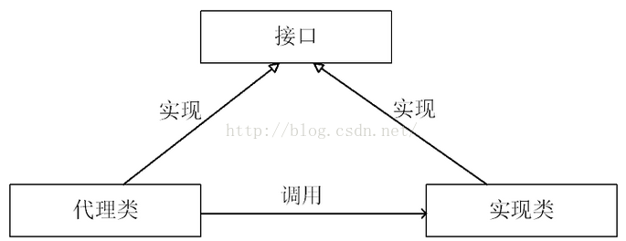

# 设计模式

## 单例模式

单例模式要注意，构造方法必须是私有的，对象的实例保存在类的静态变量中，保证在多线程情况下只有一个对象，也可以是枚举值。

### 饿汉式

先创建好实例，然后直接拿来用，没有线程安全的问题，因为虚拟机会保证初始化时给静态变量赋值的操作在多线程中是被加锁的。缺点是浪费空间。

```java
public class SingleTon{
    public static SingleTon instance = new SingleTon();
   	public static SingleTon getInstance(){
        return instance;
    }
    private SingleTon(){}
}
```

### 懒汉式

先不创建实例，到有需要的时候再去创建。缺点：不是线程安全。

```java
public class SingleTon{
    public static SingleTon instance = null;
   	public static SingleTon getInstance(){
   		if(instance == null){
   			instance = new SingleTon();
   		}
        return instance;
    }
    private SingleTon(){}
}
```

### 双重加锁懒汉式

线程安全，需要判断两次，并且要求该对象是volatile，只判断一次还是线程不安全或者是加大开销。

这里的volatile关键字并不是为了可见性，因为synchronized就保证了可见性。而是为了防止2处的指令重排序，A线程生成了一个未初始化的singleton实例时，直接被B线程（在2处）返回。因为生成对象的指令是1.申请空间-2.初始化-3.修改引用，重排序后3可以在2之前进行，当A执行完3，没执行2，这时被B读到就有问题。

```java
public class SingleTon{
    public volatile static SingleTon instance = null;
   	public static SingleTon getInstance(){
   		if(instance == null){ //1
            synchronized(Singleton.class){
                if(instance == null){
                    instance = new SingleTon();//2
                }
            }
   		}
        return instance;
    }
    private SingleTon(){}
}
```

### 静态内部类

静态内部类会在外部类调用它时被初始化，并且虚拟机保证只初始化一次，实现了线程安全。静态或非静态的内部类，其中的变量和方法都可以被外部类访问到，包括private。

```java
public class SingleTon{
    private static class SingleTonHolder{
        private static SingleTon instance = new SingleTon();
    }
    public static Singleton getInstance() {
		return SingletonHoler.instance;
	}
    private SingleTon(){}
}
```

**注**：单例模式会被反射破坏。

### 枚举单例

```java
public Enum Singleton{
	INSTANCE;
	public Singleton getInstance(){
		return INSTANCE;
	}
}
```

为什么要用枚举单例？

私有化构造器并不保险，反射可以破坏其访问权限。另外一点是当单例对象被序列化后，readObject方法会产生一个新的对象，也破坏了单例，也可以实现一个readResolve方法，取代新建的对象。使用枚举类时，序列化是将枚举对象的name进行序列化保存，反序列化时根据name值去map，找到枚举对象。另一方面反射的不允许新建枚举类对象，因此也可以实现单例。

## 代理模式

**概述**：为其他对象提供一种代理以控制对这个对象的访问。

代理类和被代理类想要具有同样的方法，必须首先实现了相同的接口。结构如下：



**应用场景：**在某些情况下，一个客户不想或者不能直接引用另一个对象，而代理对象可以在客户端和目标对象之间起到中介的作用。 同时，代理对象可以在执行真实对象操作时，附加其他的操作，相当于对真实对象进行封装。 

## 工厂模式

### 1. 简单工厂模式

工厂类中包含了**所有**的判断模式，之后不会再添加，否则违反了开闭原则，去除了客户端与具体产品的依赖

### 2. 工厂方法模式

客户端决定实例哪一个工厂，判断逻辑在客户端。但是不会修改已有的工厂类，只是添加新的工厂类。

## 责任链模式


# 六大原则

## 开闭原则

**一个软件实体应当对扩展开放，对修改关闭。即软件实体应尽量在不修改原有代码的情况下进行扩展。**

尽量使程序面向接口编程，通过扩展接口的实现类来修改程序。

## 依赖倒置原则

上层模块不应该依赖底层细节。模块应该面向接口，上层模块只关联底层的抽象。具体细节依赖抽象。

优点：低耦合，重用性加强。

## 里氏替换原则

一个父类对象全部被子类对象替代，程序将不会出现任何错误。反之则不成立。应用场景是通过多态来保证开闭原则。

