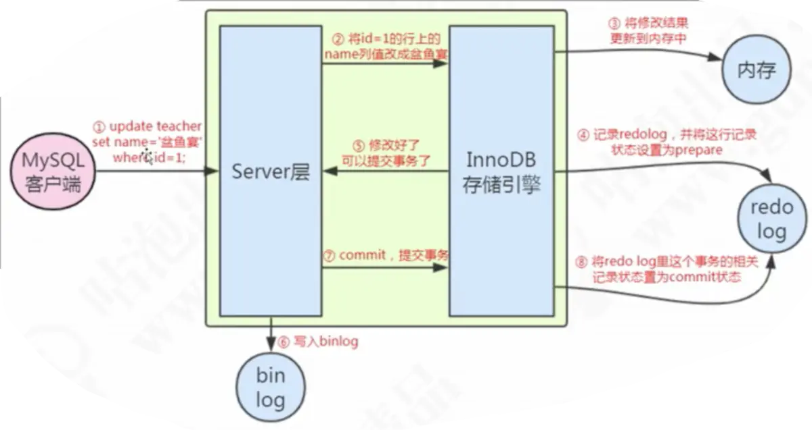

# 基础知识

### SELECT语句顺序

* **select**  返回要的列或表达式
  
  * 计算字段：
    * 拼接：concat()，内部类似于System.out.println()，只不过是把拼接的‘+’换成‘，’，并且双引号替换成单引号
    * 四则运算
  * 函数：也可以用于where后面的条件
  * RTrim()：去掉数据右侧多余的空格
  
* **from**  从中检索数据的表（仅在从表选择数据时使用）

* **where**  行级过滤，where 子句的作用是对查询结果进行**分组前**，将不符合where条件的行去掉，即在分组之前过滤数据，**where条件中不能包含聚组函数**，使用where条件过滤出特定的行。
  
  * 等于是单等号
  * BETWEEN AND 在指定的两个值之间
  * 为空 IS NULL；不为空 IS NOT NULL
  * IN(a，b) 在a，b之间的所有都可以匹配 
  * _下划线通配单个字符， %通配0个或多个字符
* REGEXP ‘正则表达式’
  
* **group by**  分组说明（仅在按组计算聚集时使用）

  group by 中的每个列必须是检索列或者是有效的表达式，但不能是聚集函数，**在于select同时使用时，select指定的非聚集函数字段必须包含在group by中**，例如

  ```sql
  SELECT col1, col2, SUM(col3) GROUP BY col1;
  ```

  这句就是错误的。

* **having** 组级过滤（在分组之后使用）having 子句的作用是筛选满足条件的组，即在分组之后过滤数据，**条件中经常包含聚组函数**，使用having 条件过滤出特定的组，也可以使用多个分组标准进行分组。

* **order by**  输出排序顺序，也可以按多个列排序，默认升序（ASC），降序是DESC，放在列名后面，只作用于它前面的列，如果多个列降序，那么必须每个列后面都加DESC，不加的列就是升序。

* limit  要检索的行数

### 聚集函数

AVG(列名) 求平均值，忽略值为null的行，列名作为函数参数

COUNT() 计算数目，count(*) 是计算行的数量，count(col)是对特定列具有的行数统计，除去值为null的。count(\*)不会读取具体的记录的字段，而count(col)会去读并且判断是否为空。count(1)相当于在记录中加了一列为1的记录，也会包含null。执行效果和count(\*)类似。建议使用count(\*)。

MAX() 求最大值

MIN() 求最小值

SUM() 求和

### 插入语句

INSERT  INTO 表名(属性名1， 属性名2，...)  VALUES(属性1， 属性2，...)，(属性1， 属性2，...);

### 修改语句

UPDATE 表名 SET 列名 = 属性值 WHERE 条件

### 删除语句

DELETE  FROM 表名 WHERE 条件

delete 是删除指定行，并且存在事务中，支持回滚。

TRUNCATE TABLE 是删除表中所有数据，执行速度快，不能回滚，有外键约束要使用delete

drop 删除了整个表包括表的结构。

### 创建表

CREATE TABLE 表名（列名1 数据类型 约束条件，

列名2 数据类型 约束条件，...）ENGINE = 引擎类型

### 更新表

ALTER 常用于定义外键

ALTER TABLE ADD 列名 数据类型 约束条件

ALTER TABLE DROP COLUMN 列名

### 多表联查

SELECT  属性1， 属性2  FROM  表1   连接方式    表2   ON   表1.属性1  =  表2.属性1 

关于**on**和**where**的用法：

1. 表A和表B先进行笛卡尔连接
2. 根据on的条件删除笛卡尔连接中不符合要求的
3. 根据连接方式添加外部行
4. 根据where条件筛选出上一步中不符合的。

### 判空

SELECT ifnull（（子查询）, 自定义结果）as 结果名

如果子查询结果为空，就返回 自定义结果。

如果是条件中判断是否为空， 用**is null** 或者是 **is not null**，不要用 = null，= Null的判断会永远返回0行，但没有语法错误

**Exist**：如果子查询包含任何行，则EXISTS运算符返回true。 否则它返回false，null值也是true。

### Limit offset

SELECT   FROM  TABLE1  ORDER BY  COL1 ASC/DESC , COL2 ASC/DESC  LIMIT NUM1 OFFSET NUM2

按排序规则，跳过前num2条记录， 取出接下来的num1条记录

### 关联子查询

样例：**查询工资大于同职位平均工资的员工信息** 表结构（name，salary，job）

```sql
select * from emp as e
where sal >(select avg(sal) from emp where job = e.job);
```

执行顺序：

1. 首先执行外查询 select * from emp e，然后取出第一行数据，将数据中的JOB传递给内查询
2. 内查询(select avg(sal) from emp where job = e.job) 根据外查询传递的JOB来查询平均工资，此时相当于select avg(sal) from emp where job = ‘CLERK’;
3. 外查询取出的第一行数据比较sal是否大于内查询查出的平均工资，若大于，则保留改行作结果显示，反之则不保留
4. 依次逐行查询、比较、是否保留；类似Java的for循环一样

### 并集、交集、差集

union能将两个查询结果集合并起来，并且去除重复的结果集，然后根据查找的第一列属性进行排序。

union all不会去除重复的结果集，并且不会默认排序。

Intersect，对两个结果集进行交集操作，不包括重复行，同时进行默认规则的排序。

Minus，对两个结果集进行差操作，不包括重复行，同时进行默认规则的排序。

### 存储过程

创建：CREATE PROCEDURE 函数名（函数参数）

包含一组sql语句，编译后存储在数据库中，通过**call**指定函数名和参数来调用。

**优点**：

1. 减少网络流量，只需要函数名和参数
2. 执行速度快，因为被预编译过，只有第一次运行会被优化。
3. 与程序代码分离，解耦
4. 可以通过限制存储过程的权限，实现对数据库访问的安全

**缺点**：

1. 编写复杂、调试困难
2. 迁移数据库时移植性差

## 练习样例

1. 检索不同的行，让某元素的出现不重复，也可以用于统计某列有多少不同的值。

   ```sql
   SELECT DISTINCT table.col1, table.col2 FROM table;
   ```

   DISTINCT 除去查询结果中的重复记录。**DISTINCT关键字应用于所有列而不仅是前置它的列**。当对**一列**查询操作时，选取该列不重复的记录；当对**多列**查询时，会将多列拼接成一列，然后再对拼接好的去重，例如（（1,2）（1,3））两个记录虽然有一列重复，但是拼接之后不重复。

   DISTINCT必须放在第一个查询的列之前，以下这种写法是错误的。

   ```sql
   SELECT table.col1, DISTINCT table.col2 FROM table;
   ```

   如果要使DISTINCT只对某一列起作用，使用group by，但是不建议使用这种方法，会遗漏其他列的数据。

   ```sql
   SELECT table.col1, table.col2 FROM table GROUP BY table.col1;
   ```

   或者是

   ```sql
   SELECT GROUP_CONCAT(DISTINCT table.col1) AS col1, table.col2 FROM table GROUP BY table.col1;
   ```

   注意：

   * DISTINCT查询可以包含null

   * DISTINCT不能和ALL同时使用

   * DISTINCT经常与COUNT()共用，但是会过滤null，统计某一列有几个值

     ```sql
     SELECT COUNT(DISTINCT table.col1) FROM table;
     ```

2. 查询学生中总分最高的前5人。（表结构：学生id，课程号，成绩）

   ```sql
   SELECT stu, sum(score) as sum FROM table ORDER BY sum GROUP BY stu LIMIT 5;
   ```

   查询5到10名。如果查询不够limit的数量，有几行返回几行

   ```sql
   SELECT stu, sum(score) as sum FROM table ORDER BY sum GROUP BY stu LIMIT 5 OFFSET 5;
   ```

3. 返回指定id学生的平均分。（表结构：学生id，课程号，成绩）

   ```sql
   SELECT AVG(score) AS avg_score WHERE id = xx;
   ```

4. 返回每个学生的总分。（表结构：学生id，课程号，成绩）

   ```sql
   SELECT SUM(SCORE) AS sum_score GROUP BY stu;
   ```

5. 返回平均分大于80的学生。（表结构：学生id，课程号，成绩）

   ```sql
   SELECT stu GROUP BY stu HAVING AVG(SCORE) > 80;
   ```

6. 返回所有订购了‘TNT2'产品的用户id。（表1：订单号，用户id）（表2：订单号，产品名）

   ```sql
   SELECT table1.uid WHERE table1.order_num IN (SELECT table2.order_num WHERE table2.prod = 'TNT2');
   ```

   **注意**：子查询之前的where的列，必须与子查询select的列匹配。

   ``` sql
   SELECT table1.uid WHERE table1.order_num = table1.order_num2 AND table2.prod = 'TNT2';
   ```

   **注意**：子查询可以等价为内部连接

7. 统计每个客户的订单总数,，显示客户姓名。（表1：用户id，用户名）（表2：用户id，订单号）

   ```sql
   SELECT uname，
   (SELECT COUNT(*) FROM table2 WHERE table2.uid = table1.uid) AS orders 
   FROM table1； 
   ```

8. 根据查询到表2的数据来更新、插入表1的数据。（表1：c1，c2）（表2：c1，c2）

   ```sql
   UPDATE table1 SET c1 = (SELECT table2.c1 FROM table2) WHERE c1 = value;
   ```

9. 查询每个学生分别选了多少门课。（表：学生id，课程id）

   ```sql
   SELECT stu, COUNT(*) AS count FROM table GROUP BY stu;
   ```

10. 查询课程1分数高于课程2分数的学生id。（表：学生id，课程id，分数）,select多个表就相当于多个表内连接。

    ```sql
    SELECT t1.stu, t1.score, t2.score FROM 
    (SELECT stu, score FROM scores WHERE class = 1) AS t1,
    (SELECT stu, s core FROM scores WHERE class = 2) AS t2
    WHERE t1.stu = t2.stu AND t1.score > t2.score;
    ```

    使用内连接方法：

    ```sql
    select t1.stu, t1.score, t2.score from scores as t1 inner join scores as t2 on t1.stu = t2.stu and t1.class=1 and t2.class = 2  where t1.score > t2.score;
    ```

    同时存在一门课程3，但是有人选修有人没选修。求课程3比课程2分高的学生。
    
    ```sql
    select t1.stu, t1.score, t2.score from scores as t1 inner join scores as t2 on t1.stu = t2.stu and t1.class = 3 and t2.class = 2 and t1.score > t2.score;
    ```
    
11. 查询选修了课程1但是没选修课程3的情况。（表结构 ：学生id，课程id）

    ```sql
    select stu from scores where stu not in (select stu from scores where class = 3) and class = 1;
    ```

    查询选修了课程3的学生，去重可以用group by，或者是distinct

    ```sql
    select stu from scores where stu not in (select stu from scores where class = 3) group by stu;
    select distinct stu from scores where stu not in (select stu from scores where class = 3) ;
    ```

    查询选修了多门课程的学生并显示选修了多少门课

    ```sql
    select stu, count(*) as count from scores group by stu having count(*) > 1;
    ```

12. 删除表中除了自增主键之外重复的数据

    1. 使用子查询方法，先查询重复的分数

       ```sql
       (SELECT score from scores GROUP BY score HAVING count(*) > 1)
       ```

    2. 在查询这些分数中的可选的自增主键

       ```sql
       select MIN(id) from scores group by scores HAVING count(*) > 1
       ```

    3. 删除分数在子查询1中的但是自增主键不在子查询2中的

       ```sql
       delete from scores where score in (select t1.score from (SELECT score from scores GROUP BY score HAVING count(*) > 1) as t1) and
       stu not in ( select t2.stu from (select MIN(stu) as stu from scores group by score HAVING count(*) > 1) as t2) 
       ```

       这里必须注意，mysql中查询操作不能和修改操作在同一张表，否则会报错。应该先将子查询的结果，再通过中间表select一次，并且起别名，就可以规避问题

## 视图

视图是虚拟的表，只包含使用时动态检索视图的查询。

优点：保护数据，授权表的特定部分的访问权限，简化SQL操作

当视图与表时一对一关系时，修改视图也会修改对应表。当视图与表时一对多关系时，修改只能对视图起作用。

尽量不要修改视图，因为可能没有考虑到表中数据的限制。

# 高级知识

## MySQL服务器逻辑架构

客户端发来连接请求，被分派给mysql的多个线程执行。

第二层服务器层包含查询解析、优化、分析、缓存及内置函数、存储过程、触发器、视图的实现。

第三层存储层包含存储引擎，管理事务。引擎是在创建表的时候指定的。

**一条sql语句在mysql中的执行过程**：

1. 连接器判断用户名和密码是否正确
2. 如果开启查询缓存，则去检查缓存有没有数据
3. 通过分析器对sql语句进行分析，若有错误则返回
4. 优化器根据各种角度进行优化，例如多个索引如何选择，多表联查如何选择关联顺序，生成执行计划
5. 执行器根据权限去调用存储引擎的接口，返回接口执行结果

## Innodb

innodb会为增删改操作自动开启事务，并自动提交或回滚。

### innodb 后台线程

1. master Thread：将缓存池中的数据异步刷新到磁盘
2. io Thread：处理异步io的回调请求，一个insert buffer线程，一个日志线程，四个读线程和四个写线程
3. purge Thread：回收使用并分配的undo页
4. page cleaner thread：刷新脏页

### innodb 存储结构

表是基于聚簇索引建立的，这里的聚簇索引就是主键索引。其他各种索引都是非聚簇索引。如果没有主键，那么会有以下几种处理办法：

```
a) 先判断表中是否有"非空的唯一索引"，如果有
    1) 如果仅有一条"非空唯一索引"，则该索引为主键
    2) 如果有多条"非空唯一索引"，根据索引索引的先后顺序，选择第一个定义的非空唯一索引为主键。
b) 如果表中无"非空唯一索引"，则自动创建一个6字节大小的指针作为主键，比如自增id。
```

支持热备份。

### innodb的锁机制

innodb默认实现了行级锁，并且根据兼容性实现了共享行锁和排他行锁。事务提交或回滚时会自动释放锁。

所有行锁算法都是基于索引实现，锁定的也是索引或者索引区间，索引失效就会转为使用表锁。

除了显示加锁的情况，其他的加解锁都不需要人工干预。

### 共享锁和排它锁

**共享锁（S锁）**：只能给读操作加锁，在查询语句结尾使用 lock in share mode，其他事务也可与对被加锁的数据加共享锁，或者不加锁读，但是不能修改和加排它锁读

**排它锁（X锁）**：在查询语句之后使用 for update，或者是update、delete、insert语句自动就有排它锁。其他事务可以不加锁读，但是不能修改和加任何锁读。

X锁和S锁都是针对记录来加锁的，即行锁。

### 当前读和快照读

当前读即加读锁，保证其他并发事务不能修改当前记录，直至读锁被释放。使用next-key作为事务隔离技术。

快照读即不加锁读，读取的快照记录不是最新版本，通过mvcc实现。RR隔离级别中不显式加共享锁或者 for update 的select操作默认都是快照读。

### 一致性锁定读和一致性非锁定读

当某表有外键约束时，外键列会被innodb加索引，避免了表锁。同时对于插入或修改外键值的时候，会先去select父表，这个select使用的是锁定读。因为不加锁就会破坏外键约束。

所有锁定语句在事务提交的时候都会被解锁。

一致性非锁定读靠mvcc实现。

### MVCC多版本并发控制（rr和rc隔离级别使用）

好处：读不加任何锁，读写不冲突，对于读操作多于写操作的应用，极大的增加了系统的并发性能。主要是解决了幻读问题。即使某行被加了X锁，也可以读。

实现原理：

1. 隐式字段：最近修改事务ID，回滚指针（指向回滚到的记录）。新的事务修改数据会指向旧的修改，形成一条记录链。
2. undo log：insert时产生undo log，事务回滚时需要，在事务提交后被放入删除列表中，只有没有事务涉及到该undo log时，才会被purge线程清除；update和delete可能会影响快照读，所以需要保留undo log来使快照读能读到之前的数据。
3. readview：事务进行快照读的视图，当事务开启快照读，就会产生一个快照，并且**维护一个活跃事务的id**。可见性算法：先判断是不是提交记录的事务id小于当前**活跃的所有事务**的id，如果是则可见；再判断是不是大于现在**已经出现**的事务id的最大值，如果是则表示实在readview生成后才出现的事务，不可见；最后再判断在不在记录的活跃事务列表中，如果在，那说明数据还没有commit，不可以读，如果不在则证明事务已经提交则可以读。

RR和RC的差异：RR是在第一次读时创建readview，并且记录当时的活跃事务，之后一直用这个readview和活跃列表。而RC则是每次读都生成一次readview。但是**修改的时候**进行的是当前读，这里可能会有幻读的问题。

缺点：需要额外的储存空间和维护工作。


## InnoDB 和 MyISAM 的区别

1. myisam支持全文本搜索，innodb不支持（1.2后支持），支持的原理是使用了倒排索引，键的内容是单词，对应的值的内容是文档id、文档id中该词的位置；另外也可以对前500个字符建立索引。
2. innodb支持事务处理，myisam不支持，innodb崩溃后可以恢复到安全状态
3. innodb支持外键
4. innodb是聚集索引（B+），mysiam是非聚集（B+）
5. **InnoDB支持表、行(默认)级锁，而MyISAM支持表级锁**
6. myisam的缓冲池只缓冲索引文件，不缓存数据文件
7. myisam可以压缩表，减少磁盘io。但是不能修改压缩表。

## 并发控制

### 锁粒度

**表锁**：锁定整张表，开销最小。写锁是排它锁，读锁是共享锁。查询给表加读锁，更新给表加写锁。

**行锁**：innodb实现了行级锁，在存储引擎层。开销最大。行锁针对索引起作用，如果查询时没有用到索引或者索引失效，则行锁自动升级为表锁。

### 锁算法

**记录锁** ：锁定一行记录，锁住的是索引，没有索引就锁住主键。

**间隙锁**（gap-lock） ：锁定一个区间，内部不包含记录。根据检索条件，向左找到第一条记录作为左区间，向右找到第一条记录作为右区间。加这个锁是为了防止幻读。在RC隔离级别下，非唯一索引的列被加锁，不会扩展间隙锁。

**Next-key lock** ：记录锁和间隙锁的组合，使用范围条件检索数据并请求共享或排它锁时，innodb会给已有数据记录的索引加锁。当查询的列是**唯一索引**时，会降级为记录锁。只有在RR的隔离级别下才使用。

当查询的值不是唯一索引，就需要在相同索引值都加锁，这里包括多个记录锁和至少一个间隙锁。

如果检索条件是非聚簇索引且是单一查找，在RR隔离级别下，如果是唯一索引，那么会在对应的非聚簇索引和对应的聚簇索引都加一个锁。如果是非唯一索引，就是在对应的主键加行锁，辅助索引加行锁和间隙锁。

如果查询条件上没有索引，就会全表扫描，先全部加锁，对于不符合条件的记录，加锁后立马释放。

### 意向锁

为了解决行锁和表锁冲突问题，产生了意向锁。为了让行锁和表锁之间互相感受到存在。innodb自动帮我们实现。

**意向共享锁** ：在读数据前先申请这个锁，当有修改的时候就会发现有事务正在读，就会阻塞写。

**意向排它锁** ：在修改数据前先申请这个锁，其他事务的读写都会被阻塞。

解决死锁的办法是将持有最少行级排它锁的事务进行回滚。

通过多版本并发控制（MVCC）加间隙锁解决了幻读问题。

### 死锁

死锁检测：在每个事务请求锁并发生等待时，innodb主动生成事务等待链表，如果链表有环，则存在死锁。

会回滚undo量最小的事务，直到死锁被解开。

常见原因：当事务A申请了X锁，事务B申请了部分的S锁，但是申请到X锁的记录时被阻塞，A就不能往非X锁但是在S锁内的记录里插入数据，否则B就还需要向后获得这部分的记录，不合理。innodb主动认为这是死锁。

insert into select 如果按照主键顺序扫描被复制的表时，会依次对扫描过的记录加锁，如果是对非主键顺序，则会一次性锁住整张表。

## 事务

### autocommit与手动事务

当autocommit为0时，事务在用户对数据进行操作时自动开启，必须手动commit，否则就会回滚。

当autocommit为1时，如果已经显式的开启了事务，就不会自动提交，必须手动commit。如果没有显式开启事务，每条sql语句都是一个事务，都会自动提交。

#### 原子性

事务要么全部提交成功，要么全部失败回滚。

#### 一致性

状态的一致性，从一个状态正确的迁移到另一个状态。例如转账后总金额不变。

#### 隔离性

事务在最终提交之前，对其他事务不可见。

#### 持久性

事务提交后，修改就会永久保存到数据库中。

### 日志

#### 1. 二进制日志

二进制日志文件只是保存了对数据库的变更，对没有变更的数据操作不会记录到二进制日志。**逻辑格式**的日志，可以简单认为就是执行过的事务中的sql语句。事务提交的时候，一次性将事务中的sql语句（一个事物可能对应多个sql语句）按照一定的格式记录到binlog中。一定时间后自动释放空间。用于还原数据库。binlog是查询之后由**执行器**记录的。

#### 2. redo log

事务在执行的过程中，会先写入操作到缓冲中，然后缓冲中的日志再刷新回磁盘中。这个刷新过程可能在事务提交之前。但是事务提交之后，缓冲池中的数据记录才会被刷新回磁盘。如果在某一步数据库宕机，可以恢复到之前数据库的某个状态，要么重新提交事务，要么回滚。redo log保证了事务的持久性和一致性。**物理格式的日志，记录的是物理数据页面的修改的信息**，其redo log是顺序写入redo log file的物理文件中去的。当对应事务的脏页写入到磁盘之后，redo log的使命也就完成了，重做日志占用的空间就可以重用（被覆盖）。为了保证提交的事务在任何情况下都不会丢失，使用**两阶段提交**。当事务写入redo log，记为prepare，然后commit时，先将事务写入binlog，然后再记录redo log事务为commit。这样即使在某个过程中宕机，会去扫描redolog，如果有commit，就提交；如果只compare，如果binlog有对应XID的记录，就提交，否则就回滚事务。一阶段提交会导致主从数据不一致。因为从库只复制主库的binlog。



#### 3. undo log

记录事务操作的反向操作。用于回滚事务或者保证MVCC。保证了事务的原子性。逻辑格式的日志，在执行undo的时候，仅仅是将数据从逻辑上恢复至事务之前的状态。

## 隔离级别

隔离级别是为了在性能和并发安全性之间做一个取舍。

### read uncommit

事务中的修改在未提交之前对其他事务可见。会出现脏读。

### read committed

一个事务开始到提交之前，只能看到已经提交的事务的修改。并且他的修改在提交之前对其他事务也不可见。就是A事务先开启，然后查询得到结果1，B事务修改数据并提交，A再查询得到结果2，两次读的结果不一样。也叫不可重复读。

### repeated read（innodb默认隔离级别）

首先注意是可以读取提交的，比如事务A、B都开始了，B先修改数据并提交了事务，这时如果A没有读过该记录，那么建立的readview就会包含B的提交。

保证了同一个事务中多次读取同样记录的结果是一样的，但是会出现幻读。指在读取时有其他事务添加了新的记录，该事务再次读取该范围记录会出现多出来的行。幻读通常是在写操作时发现的。

### SERIALIZABLE

所有事务以串行方式执行

## 索引

索引是存储引擎用于快速找到记录的一种数据结构。快速找出在某个列中有一个特定值的行。索引可以让服务器快速定位到表的指定位置。

B-Tree索引按照顺序存储数据，可以执行order by和group by操作。减少了服务器需要扫描的数据量，帮助服务器避免排序和临时表，将随机I/O变成顺序I/O。

### hash 结构索引

由于是计算hash一次对应数据，所以适用于**等值查询**。如果要范围查询则需要扫描整张表。hash索引也**不支持部分索引键查询**，也**不能实现排序操作**。不支持多键联合索引的最左前缀匹配，因为组合索引加在一起计算，还存在**hash碰撞**问题导致效率低下。

innodb中是否产生hash索引是自适应的，无法人为决定是否产生。

### B/B+Tree 结构索引

B+树索引并不能返回给定键值的具体行，只能返回该行所在的页。然后将该页加载到内存中，找到具体行。

B+Tree相对于B-Tree有几点不同：

1. 非叶子节点只存储键值信息，存key对应的数据则会导致一个节点存储的key少，而导致深度过大，因此B+树适合范围查询，而B树单一查询效果更好，最好只查一次，因此**非关系型数据库**常用B树而不用B+。而且由于局部性原理和磁盘预读，附近的数据也会被读入内存中，hash索引则无法实现这一点。
2. 所有叶子节点之间都有一个链指针，所以B+树适合遍历记录。
3. 数据记录都存放在叶子节点中。

\- 为什么索引要使用B+树 - 一般来说，索引本身也很大，不可能全部存储在内存中，因此索引往往以索引文件的形式存储的磁盘上。这样的话，索引查找过程中就要产生磁盘I/O消耗，相对于内存存取，I/O存取的消耗要高几个数量级，所以评价一个数据结构作为索引的优劣最重要的指标就是在查找过程中磁盘I/O操作次数的渐进复杂度。换句话说，索引的结构组织要尽量减少查找过程中磁盘I/O的存取次数。而B-/+/*Tree，经过改进可以有效的利用系统对磁盘的块读取特性，在读取相同磁盘块的同时，尽可能多的加载索引数据，来提高索引命中效率，从而达到减少磁盘IO的读取次数。 - 1、 **B+树的磁盘读写代价更低**：B+树的内部节点并没有指向关键字具体信息的指针，因此其内部节点相对B树更小，如果把所有同一内部节点的关键字存放在同一盘块中，那么盘块所能容纳的关键字数量也越多，一次性读入内存的需要查找的关键字也就越多，相对IO读写次数就降低了。 - 、**B+树的查询效率更加稳定**：由于非终结点并不是最终指向文件内容的结点，而只是叶子结点中关键字的索引。 - 。所以任何关键字的查找必须走一条从根结点到叶子结点的路。所有关键字查询的路径长度相同，导致每一个数据的查询效率相当。 - **B树在提高了IO性能的同时并没有解决元素遍历的效率低下的问题，正是为了解决这个问题，B+树应用而生。B+树只需要去遍历叶子节点就可以实现整棵树的遍历。而且在数据库中基于范围的查询是非常频繁的，而B树不支持这样的操作或者说效率太低。** - B+树的特点，只有叶子节点存储数据

### 聚集索引（聚簇索引）

聚集索引具有唯一性。如果要对不唯一的加索引，就是辅助索引。

聚集索引就是将数据存储和索引放到了一起，找到索引也就找到数据。因为数据是按顺序存放的。只需要一次查询，效率更高，把整个页（包含多条逻辑上顺序的记录）都放到内存中缓存，减少了io次数，适合范围查询，如果主键不适合用范围索引，那么主键还是需要多次磁盘io。

辅助索引（二级索引）是将索引结构的叶子节点存放对应数据的指针（主键），再根据主键去找。

**索引组织表**：**索引中键值的逻辑顺序决定了表中相应行的物理顺序（索引中的数据物理存放地址和索引的顺序是一致的）**，这里的物理上和逻辑上的一致是不仅数据页之间有双向链表维护，页内的记录之间也有双向链表。
比方说：想要到字典上查找一个字，我们可以根据字典前面的拼音找到该字，注意拼音的排列时有顺序的。

- 如果一个主键被定义了，那么这个主键就是作为聚集索引
- 如果没有主键被定义，那么该表的第一个唯一非空索引被作为聚集索引，是定义索引的顺序，不是定义列的顺序
- 如果没有主键也没有合适的唯一索引，那么innodb内部会生成一个隐藏的主键作为聚集索引，这个隐藏的主键是一个6个字节的列，该列的值会随着数据的插入自增。

**为什么使用自增主键做索引？**

因为自增主键在新增数据时，只会获得更大的主键，也就是B+树只会在最后增加新记录，开辟新页存放，不需要插入到中间导致频繁的数据移动，产生更多的B+tree分裂。

### 稠密索引和稀疏索引

**稠密索引**为每个搜索码值都建立一个索引值，指向被索引到的数据文件。

**稀疏索引**为部分搜索码值建立索引值，前提必须索引值是有序的。所以就根据附近的索引能找到相关的数据文件。

比较：稠密索引比稀疏索引能更快的定位一条记录，但是占得空间更大，插入删除数据时所需的开销也更大。

### Mysql各种索引（按索引类型和属性）

**普通索引**：最基本的索引，没有任何限制。使用index创建。
**唯一索引**：与"普通索引"类似，不同的就是：索引列的值必须唯一，但允许有空值。使用unique创建。
**主键索引**：它 是一种特殊的唯一索引，不允许有空值。 使用primary key创建
**全文索引**：仅可用于 MyISAM 表，针对较大的数据，生成全文索引很耗时好空间。使用fulltext创建。
**组合索引**：为了更多的提高mysql效率可建立组合索引，遵循”最左前缀“原则。 使用index创建。
**索引覆盖**：SQL只需要通过索引就可以返回查询所需要的数据，而不必通过二级索引查到主键之后再去查询数据，所以不是所有非聚簇索引都要再去通过主键索引查一次（回表）。

需要额外的时间空间来创建和维护索引，在修改表的数据时，也会修改索引。

同时存在联合索引和单列索引（字段有重复），mysql根据查询语句成本来选择走哪条索引。

**merge_index**: 如果where条件中有多个索引，则可能会对每个索引分别进行条件扫描，然后将结果进行交集或并集。满足左前缀的组合索引也会合并结果集。

### 使用索引的原则

1. 在经常查询的字段创建索引，经常更新的表避免过多索引
2. 数据量少的表不要建立索引
3. 某列的值很少，如性别只有男女，则不要建立索引，相反则应该建立
4. 使用短索引。如果对字符串列进行索引，应该指定前缀长度，只要有可能就应该这样做。节省了索引空间，加速查询。但是前缀索引**无法进行排序和分组**。
5. 根据选择性和基数的经验法建立索引。

### 索引失效的情况

1. like 且如果匹配字符串的第一个字符为“%” ，会失效

   解决方法：使用覆盖索引，或者将 %通配符放在不是第一位的位置上。

2. 如果是多列组合索引，必须遵守最左前缀原则，指从索引的最左前列开始并且不跳过索引中的列。违反了最左前缀原则，就会导致索引全部失效或部分失效。

3. 在索引上使用计算或者函数等，会使索引失效

4. 索引即使按照最左前缀原则，在范围查找之后，该索引后面的索引失效。因为在第一列属性相等的情况下，第二列属性才是有序的，否则是无序的，所以索引会失效

5. 使用！= 或<>时索引失效

6. is not null 或者 is null 无法使用索引

7. 隐私类型转换使索引失效 ，比如字符串不加单引号会使索引失效

8. 有or则组合索引失效，必须为or条件的每个列都加索引

9. **当全表扫描速度比索引速度快时，mysql会使用全表扫描。**

## 查询优化手段

**explain**：解释某个sql语句的执行情况，查看查询类型和查询中使用的索引、读取到的行数。explain是通过估计得到的结果。并且无法确定是临时表还是磁盘表。

慢查询：MySQL记录下查询超过指定时间的语句，超过指定时间的SQL语句查询称为“慢查询”。

获取慢查询的方式：数据库中设置开启mysql慢查询，设置自定义的查询时限，超过时限的就是慢查询，会记录在日志中。

分析慢查询的方法：

1. show profile
2. show status
3. 使用performance schema


- 设计数据库时：数据库表、字段的设计，存储引擎
- 利用好MySQL自身提供的功能，如索引等
- 横向扩展：MySQL集群、负载均衡、读写分离
- SQL语句的优化（收效甚微）

# 设计数据库的良好习惯

### schema设计

**数据类型优化**：

* 尽量使用可以正确存储数据的最小数据类型。这样可以占用更少的磁盘、cpu、内存资源。
* 使用最简单的类型来存储，比如用mysql内置类型而不是字符串来存日期时间。
* 尽量避免null列，会影响索引、查询条件

varchar的优缺点：使用1到2个额外字节记录字符串长度，update时可能会导致页的分裂，产生页内碎片。在最大长度远大于平均长度时，使用varchar非常节省空间。尽量分配满足大小的最小长度，否则在使用内存临时表进行排序时会占据很大的空间。

char的优缺点：在字符串很短时使用char节省额外空间。适合存储定长字符串。

Blob和Text：blob是二进制数据，没有排序规则和字符集。

## 主键

1. 不更新主键列中的值
2. 不重用主键列的值
3. 不在主键列中使用可能会更改的值

## 范式

**优点**：更新操作更快，冗余数据少，表更小，很少使用distinct和groupby

**缺点**：复杂一点的查询都需要关联，而且无法很好地利用索引。

**1NF**

所有的属性都是最小的不可再分的，不满足则无法建表

**2NF**

候选码：一组元素可以唯一的表示一条记录，同时元素中的真子集不能唯一的表示一个元组。

主属性：候选码中的属性。

要求非主属性必须完全依赖于码。

**3NF**

要求非主属性不能传递依赖于码。也就是说非主键的属性之间不能有依赖关系。

**BCNF**

要求主属性不能部分依赖或传递依赖于码。

